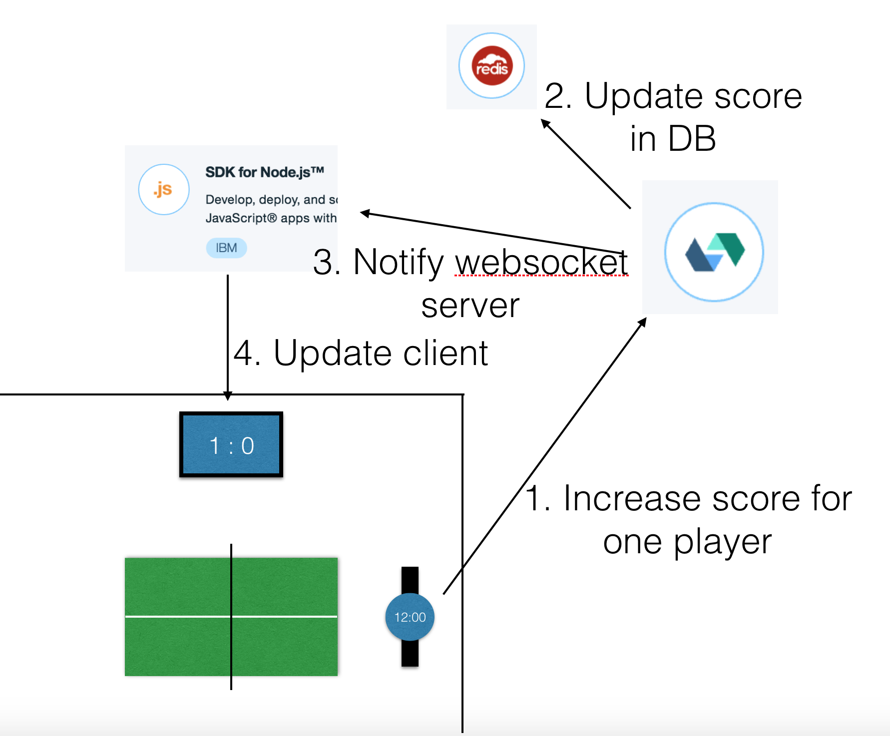

# Building an app with OpenWhisk and Bluemix

Hi, I'm Christian, one of the core developpers of OpenWhisk. In the location, where I work, the team is sitting in one room. On the walls are monitors that display the pipeline status and one quarter of the room is taken by a table tennis table.

What is not surprising is, that this table is often used by us. And if two developpers play against each other, nearly the whole team wants to know the result of the match.

So I had the idea to write a webapp, which displays the current score. Of cause, I want to use OpenWhisk in the backend.

## Components

First to the hardware. To display the score, the monitors of the pipeline can be used. With a slackbot, that already exists, it is possible to show any websites on them.
Next there needs to be a mechanism to increase the points. I thought, that the easiest way would be using my Pebble smartwatch. On pressing one of the buttons, a request should be performed to update the score.

As second part I have to make a descision on the software components. As I mentioned above, I want to use OpenWhisk. It will receive the requests, update the score in the database and doing stuff like handling the sets automatically.
In Bluemix you can choose of several databases. OpenWhisk already has a very good support for cloudant. But you can also order an instance of a Redis DB. The reason why I use the Redis DB is, that it has the command `incr [key]` to increment the value, stored with the key, atomically. Second reason is, that I want to try something new, because I have never worked with Redis before.
Next problem is to display the new score on the monitors after it has been updated in the DB. Unfortunately, there is only one solution to realize this with OpenWhisk: let the client poll for the result. As this is not acceptable to me, I decided to use a CF-App on Bluemix. This app provides the client side code, keeps sockets open to the client to update the result, and it listens on changes of the result.



## Using Redis with OpenWhisk

Currently, there is no existing OpenWhisk-package to use a Redis DB. But since it is possible to upload npm modules as an action it is really easy to create an own package.

Regarding the documentation and some examples of the Bluemix Redis Service, they use the npm-package called `Redis`.
To create an own Redis package, you have to use the command `wsk package create Redis`. Now the package is created, Now we only have to add some actions to the package.

To create our first Redis action, you have to create an directory with the files `package.json` and `index.js`.
The `package.json` has the following content:
```
{
  "name": "del",
  "version": "1.0.0",
  "main": "index.js",
  "devDependencies": {
      "redis": "*"
  }
}
```

In the `index.js` we use the redis-module to do the DB-request. The following code is the example to delete a key. Error handling is removed to keep the example code snippet as simple as possible.
```
var redis = require("redis");

function myAction(params) {
    var key = params.key || "";

    // Create connection to Redis
    var client = redis.createClient(params.port, params.host);
    client.auth(params.password);

    // Delete the key, that was inserted as parameter and return Promise
    return new Promise(function(resolve, reject) {
        client.del(key, function(err, reply) {
            client.quit();
            console.log("Deleted: " + reply);
            resolve({ message: reply });
        });
    });
}

exports.main = myAction;

```
This code expects `key`, a `port`, a `hostname` and a `password` as parameters. If no key is specified, we use an empty String instead.
Next we create the connection to our Redis instance.
At last we execute the command to delete the key in the Database and we close the connection afterwards.
The deletion of the key is asyncronous, so we return a Promise here to indicate OpenWhisk, that the action is not finished until the Promise is resolved.

Now this action should be finished and ready to be added to OpenWhisk. To do this, we first install the npm dependencies with `npm install`. After that we zip the complete folder with `zip -r action.zip *`. At last we upload the generated ZIP-file with `wsk action create redis/$action --kind nodejs:6 action.zip`.

Now the action is available on OpenWhisk in the package Redis and can be used.

As mentioned above, we have to pass hostname, port and password on the invocation of the action. We do not want to do this, since we always use the same 
